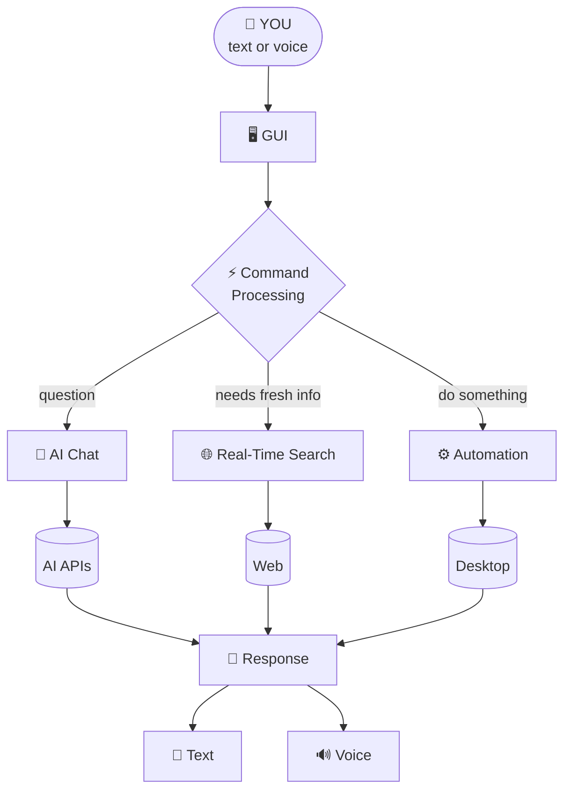

<div align="center">

```
 ██████╗██╗  ██╗ █████╗ ██╗  ██╗ █████╗ ██████╗
██╔════╝██║  ██║██╔══██╗██║ ██╔╝██╔══██╗██╔══██╗
██║     ███████║███████║█████╔╝ ███████║██████╔╝
██║     ██╔══██║██╔══██║██╔═██╗ ██╔══██║██╔══██╗
╚██████╗██║  ██║██║  ██║██║  ██╗██║  ██║██║  ██║
 ╚═════╝╚═╝  ╚═╝╚═╝  ╚═╝╚═╝  ╚═╝╚═╝  ╚═╝╚═╝  ╚═╝
          A  I    ·    v o i c e   ·   b r a i n   ·   h a n d s
```

### `> talk. search. decide. execute.`


**Chakar AI is a Python desktop assistant that listens, thinks, searches the web, and operates your computer, all from one window.**

</div>

---

## `[ 00 ]` SYSTEM BOOT

```console
$ python Main.py

[ OK ] Loading environment ............ .env
[ OK ] Starting GUI ................... PyQt5
[ OK ] Mic interface .................. Speech-to-Text
[ OK ] Voice output ................... Edge TTS
[ OK ] Brain online ................... Groq + Cohere
[ OK ] Search engine .................. Real-time
[ OK ] Automation layer ............... Desktop tasks

>>> Chakar is ready. Say something.
```

---

## `[ 01 ]` CAPABILITY MATRIX

| Module | What it does | Powered by |
|:--|:--|:--|
| 🧠 **Brain** | Natural-language chat and questions | Groq, Cohere |
| 🎙️ **Ears** | Talk to Chakar with your voice | Speech-to-Text |
| 🔊 **Voice** | Chakar talks back | Edge TTS, Pygame |
| 🌐 **Eyes** | Live web search for current info | Google Search, BeautifulSoup |
| ⚙️ **Hands** | Open apps, run supported computer actions | AppOpener, Selenium, Keyboard |
| 🖼️ **Imagination** | AI image generation | Image APIs |
| 🌍 **Tongue** | Translate text between languages | mtranslate |
| 🎵 **Media** | YouTube and media searches | PyWhatKit |
| 💬 **Memory** | Chat history stored locally | `Chatlog.json` |
| 🖥️ **Face** | Desktop interface | PyQt5, Pillow |

---

## `[ 02 ]` THE LOOP



`Chat → Understand → Search → Decide → Execute → Respond`

---

## `[ 03 ]` TRY THESE COMMANDS

<table>
<tr>
<td width="33%" valign="top">

**💬 Ask**
```text
What is Artificial Intelligence?
Explain Python.
How does Django work?
Give me project ideas.
Help me learn machine learning.
```

</td>
<td width="33%" valign="top">

**⚙️ Do**
```text
Open Chrome.
Open VS Code.
Open Calculator.
Open Notepad.
```

</td>
<td width="33%" valign="top">

**🌐 Find**
```text
Search Google for Python tutorials.
Search YouTube for Django tutorials.
Find information about AI.
```

</td>
</tr>
</table>

**🎙️ Voice mode**

```text
"Hey Chakar, open Chrome."
"Search for Python tutorials."
"Tell me about machine learning."
```

**🌍 Translate**

```text
Translate "Hello, how are you?" into Hindi.
```

---

## `[ 04 ]` INSTALL IN 60 SECONDS

```bash
# 1 · clone
git clone https://github.com/YOUR-USERNAME/chakar-ai.git
cd chakar-ai

# 2 · virtual environment (Windows)
python -m venv .venv
.venv\Scripts\activate

# 3 · dependencies
pip install -r Requirements.txt

# 4 · launch
python Main.py
```

**Before launching, create a `.env` file in the project root:**

```env
GROQ_API_KEY=your_groq_api_key
COHERE_API_KEY=your_cohere_api_key
```

> 💡 Use the exact variable names your source code expects.

---

## `[ 05 ]` FILE MAP

```text
Chakar-AI/
├── Main.py                     ← entry point
├── Requirements.txt
├── .env                        ← secrets (never commit)
│
├── Backend/                    ← the machinery
│   ├── Automation.py           ⚙️  desktop & task automation
│   ├── Chatbot.py              💬  conversation logic
│   ├── gpt.py                  🧠  AI / LLM functionality
│   ├── ImageGeneration.py      🖼️  image generation
│   ├── Model.py                🧭  model-related logic
│   ├── RealtimeSearchEngine.py 🌐  live web search
│   ├── SpeechToText.py         🎙️  voice → text
│   └── TextToSpeech.py         🔊  text → voice
│
├── Frontend/                   ← the face
│   ├── GUI.py                  🖥️  PyQt5 interface
│   ├── Files/                  ▫️  runtime state (mic, status, responses...)
│   └── Graphics/               ▫️  icons, Jarvis.gif, buttons
│
└── Data/
    ├── Chatlog.json            💾  conversation history
    └── Voice.html
```

---

## `[ 06 ]` TECH STACK

| Layer | Tools |
|:--|:--|
| **Language** | `Python` |
| **AI / LLM** | `Groq` · `Cohere` |
| **Voice & Audio** | `Edge TTS` · `Pygame` · Speech-to-Text |
| **Automation** | `AppOpener` · `PyWhatKit` · `Keyboard` · `Selenium` · `WebDriver Manager` |
| **Web** | `Requests` · `BeautifulSoup` · `googlesearch-python` |
| **GUI** | `PyQt5` · `Pillow` · `Rich` |
| **Utilities** | `python-dotenv` · `mtranslate` |

<details>
<summary><b>📦 Full Requirements.txt</b></summary>

```text
python-dotenv
groq
AppOpener
pywhatkit
beautifulsoup4
Pillow
rich
requests
keyboard
cohere
googlesearch-python
selenium
mtranslate
pygame
edge-tts
PyQt5
webdriver-manager
```

</details>

---

## `[ 07 ]` ROADMAP · UPGRADE PATH

```text
CHATBOT ──────▶ ASSISTANT ──────▶ AGENT
  (chat)       (search + tasks)   (plans + acts on its own)
```

<details>
<summary><b>🧠 Intelligence</b></summary>

- [ ] Long-term memory
- [ ] Better context awareness
- [ ] Conversation memory
- [ ] Intent classification
- [ ] Multi-step task planning
- [ ] Agent workflows

</details>

<details>
<summary><b>💻 Computer Control</b></summary>

- [ ] File management
- [ ] Application management
- [ ] System monitoring
- [ ] Mouse control
- [ ] Keyboard control
- [ ] Screenshot understanding

</details>

<details>
<summary><b>🌐 Online Services</b></summary>

- [ ] Weather
- [ ] News
- [ ] Email
- [ ] Calendar
- [ ] Reminders
- [ ] Maps
- [ ] Additional service integrations

</details>

<details>
<summary><b>📚 Knowledge</b></summary>

- [ ] PDF analysis
- [ ] RAG
- [ ] Personal knowledge base
- [ ] Document search
- [ ] Vector database

</details>

<details>
<summary><b>👁️ Multimodal AI</b></summary>

- [ ] Image understanding
- [ ] OCR
- [ ] Screenshot analysis
- [ ] Vision-based automation
- [ ] Camera input

</details>

<details>
<summary><b>📱 Platforms</b></summary>

- [ ] Web version
- [ ] Android application
- [ ] Mobile companion
- [ ] Cloud synchronization

</details>

---

## `[ 08 ]` SAFETY PROTOCOL

> ⚠️ Chakar can call external services and, depending on configuration, act on your computer. Treat it like a powerful tool.

| ✅ Do | ❌ Don't |
|:--|:--|
| Keep API keys private | Commit `.env` to Git |
| Review automation actions before use | Run unknown code |
| Use a virtual environment | Grant unnecessary permissions |
| Keep dependencies updated | Ignore leaked keys |

**Recommended `.gitignore`:**

```gitignore
.venv/
venv/
__pycache__/
*.pyc
.env
```

Check before pushing with `git status`. If `.env` was ever committed, remove it from tracking **and rotate the exposed API keys.**

---

## `[ 09 ]` KNOWN LIMITS

Chakar AI is an **educational and experimental** project. Results may vary depending on:

`Operating system` · `Installed apps` · `Internet connection` · `Browser setup` · `Third-party APIs` · `API availability`

Not every command works on every machine.

---

## `[ 10 ]` CONTRIBUTE

```bash
git checkout -b feature/new-feature
# make changes → test → commit
git push origin feature/new-feature
# open a Pull Request
```

Bug reports and feature ideas are welcome.

---

## `[ 11 ]` LICENSE

Currently intended for educational and personal development use. Before distributing publicly, add an open-source license after checking the terms of your dependencies, APIs, and bundled assets.

---

<div align="center">

### 👨‍💻 Built by **Your Name**

[](https://github.com/solodev-code)
[](https://www.linkedin.com/in/yoursunny369/)

**If Chakar impressed you, drop a ⭐ on the repo.**

```
💬 CHAT → 🧠 UNDERSTAND → 🔎 SEARCH → 🎯 PLAN → ⚙️ EXECUTE → 🔊 RESPOND
```

`> session end. Chakar AI, your personal AI, ready when you are.`

</div>
